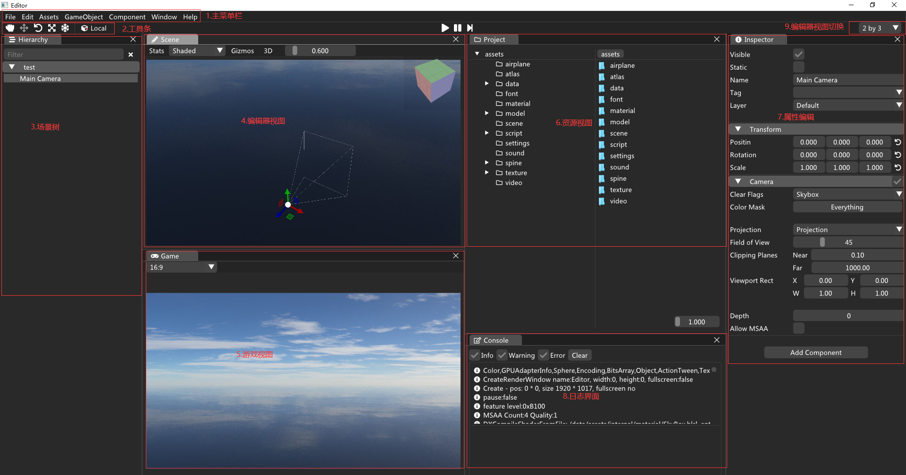
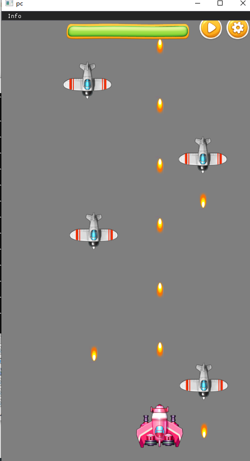

## 简介
mini3D是开源跨平台游戏开发框架，使用C++开发。提供了图形渲染、音频、GUI、网络、物理、用户输入等丰富的功能， 可广泛应用于游戏开发及交互式应用的构建！  
## 介绍
        跨平台  
                核心语言使用C++，支持Windows、Android、Linux，后续支持iOS、macOS、WebGL  
        图形API  
                Direct11、OpenGL、OpenGLES3.x(本来支持Direct9/12、Vulkan、OpenGLES2.0，考虑维护成本太大，已经删除) 
        核心模块  
                图形渲染、UI、音频、视频、网络、物理、粒子、网络、2/3D动画等  
## 编译代码
        1.提供了vs2017的sln工程文件，在trunk\solution\win。打开后选择x64，分别编译libs、engine、editor项目。
        2.依赖windowSDK10.0.17763.0，其他版本也可以，不过需要手动修改设置
        3.如果编译成功，会在trunk\bin\win\x64目录生成editor.exe，这个是编辑器运行文件
## 发布
        window：
        android：
        linux：
## 编辑器介绍  
        编辑器使用了IMGUI，提供了场景编辑、UI界面编辑
		  
## 案例
		雷霆战机
			一款2D射击游戏，在google商城有上线
		  